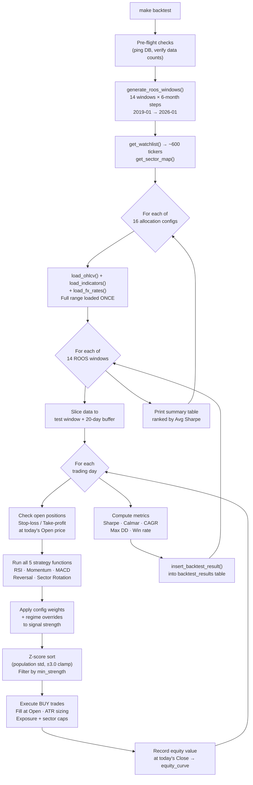

# Kairos — Algorithmic Paper Trading System

Monorepo Python + Next.js system running 5 trading strategies on ~600 US (S&P 500) and Canadian (TSX 60) equities using paper money. Self-simulated in TimescaleDB — no broker account needed. Every trade is logged with a plain-English reason.

See [ALLOCATION.md](ALLOCATION.md) for the full breakdown of signal strength, z-score normalisation, and position sizing.

---

## Tech Stack

| Layer      | Technology                                            |
|------------|-------------------------------------------------------|
| Data store | TimescaleDB (PostgreSQL 16 + time-series ext.)        |
| Backend    | Python 3.13+, pandas, pandas-ta, yfinance, numpy      |
| Scheduler  | `schedule` + `zoneinfo` (ET-aware)                   |
| Dashboard  | Next.js 15 (Phase 7)                                  |
| Container  | Docker Compose (DB only — Python runs locally)        |

---

## First-Time Setup

```bash
make install            # create backend/.venv and install all dependencies
make up                 # start TimescaleDB container (kairos_db)
make setup              # init schema, seed ~600 tickers, backfill 10yr OHLCV
make hydrate-fx         # backfill USDCAD FX rates from 2017
make hydrate-indicators # compute indicators for every historical bar (needed for backtesting)
make run                # start the weekday scheduler
```

---

## How It Works

Kairos follows a **scan → execute → manage** cycle, with CAD as the base portfolio currency.

**Evening (17:00 / 17:15 ET):** `update_all()` pulls closing OHLCV → `run_daily_scan()` computes indicators, runs all 5 strategies, and persists signals with strength + z-scores.

**Morning (9:31 AM ET):** `run_morning()` loads last night's signals, fetches the 9:31 AM opening bar for prices and USDCAD FX rate in one batch yfinance call. It first runs position management (stop-losses, take-profits, trailing stops, signal reversals, time exits) on any open positions, then sizes new positions via ATR-based risk and opens paper trades. Fill prices, FX rates, and trade timestamps are all pinned to the same 9:31 AM bar.

**Intraday (hourly, 10:00–15:58 ET):** `run_intraday()` fetches live 1-minute prices for open positions and re-runs the same position-management checks, persisting any exits / trailing-stop updates and taking a portfolio snapshot each hour.

**Evening management (17:25 ET):** `run_evening()` reads closing prices from the DB (no yfinance call) and re-runs the position-management checks on official closes. It can also be run manually with `make simulate-evening` (e.g. for historical replay with `DATE=`).

### Multi-Currency

| Market | Currency | FX source  |
|--------|----------|------------|
| US     | USD      | USDCAD=X (yfinance, 9:31 AM bar) |
| CA     | CAD      | 1.0 (base) |

FX rates are stored in the `fx_rates` table after the morning fetch; later runs (`run_intraday()`, and a manual `run_evening()`) reuse the same day's stored rate rather than re-fetching.

---

## Scheduler (weekdays only, ET)

| Time              | Job                    | What it does                                        |
|-------------------|------------------------|-----------------------------------------------------|
| 07:00             | Morning digest         | Phase 6 placeholder                                 |
| 09:31             | `run_morning()`        | Pre-open management + batch price/FX fetch → execute signals |
| 10:00–15:58 (hourly) | `run_intraday()`    | Live-price position management (stop/TP/trailing)   |
| 17:00             | `update_all()`         | Incremental OHLCV for all tickers                   |
| 17:15             | `run_daily_scan()`     | Compute indicators → generate signals               |
| 17:25             | `run_evening()`        | DB close prices → stop/TP/exit checks               |
| Every hr          | DB health check        | Runs on weekends too                                |

Weekday ET jobs are gated on the NYSE trading calendar; intraday management runs whenever NYSE **or** TSX is open. `run_evening()` is also available manually via `make simulate-evening`.

---

## Manual Commands

```bash
make fetch              # incremental OHLCV update
make scan               # indicators + signal scan
make simulate           # morning execution (9:31 bar)
make simulate-evening   # evening position management
make backtest           # ROOS backtest — all allocation configs
make backtest-config CONFIG=regime_adaptive  # single config
```

---

## Phase 4 — Rolling Out-of-Sample (ROOS) Backtesting (Phases 4 – 4.8)

Kairos tests how different **allocation configs** (strategy weight combinations) perform across 14 independent out-of-sample periods spanning ~7 years of market history (2019 → 2026).

### What `make backtest` does — step by step

1. **Pre-flight** — ping DB, verify row counts in `price_data`, `indicators`, `fx_rates`
2. **Generate 14 ROOS windows** — each window has a 2-year training period and a 6-month out-of-sample test period. Windows step forward by 6 months so the test periods never overlap
3. **Load data once** — for each config, all OHLCV, indicators, and CADUSD rates for the full date range are loaded into memory in a single DB round-trip
4. **Per-window simulation** — for each of the 14 test windows, the engine replays history day by day:
   - At **Open**: check stop-loss and take-profit exits (same logic as live `run_morning`)
   - Run all **5 strategy functions** from `strategies/` (the live code, unmodified)
   - Apply **config weights** and **regime overrides** to signal strength
   - **Z-score sort** across all signals by strategy group (same as live scanner)
   - Execute new trades with **ATR-based position sizing**, exposure caps, sector caps
   - Record end-of-day portfolio value using **Close** prices
5. **Compute metrics** per window — Sharpe ratio, Calmar ratio, CAGR, max drawdown, win rate, profit factor, annualised volatility
6. **Store to DB** — one row per config per window in `backtest_results`
7. **Print summary table** — all configs ranked by avg Sharpe across all 14 windows

### ROOS Pipeline



### Key Design Decisions

| Decision | Rationale |
|---|---|
| Live strategy functions called directly | No reimplementation risk — if live strategies change, backtests automatically reflect it |
| Fill at Open, value at Close | Matches live `run_morning` — no look-ahead bias |
| Data loaded once per config | ~600 tickers × 10yr loaded in one DB query per table — ~3x faster than per-window loading |
| USDCAD inverted to CADUSD | DB stores USDCAD (1 USD = X CAD); backtester inverts to multiply native CAD prices → USD |
| Config as JSONB in DB | Every result is fully reproducible — the exact weights used are stored alongside the metrics |
| Training window not used for tuning | Configs are fixed upfront. The training window only provides indicators context for regime detection |

### Allocation Configs

The source of truth is `backtesting/config.CONFIGS` (16 configs). Current set:

| Config | Strategy bias | Min strength | Max positions | Phase |
|---|---|---|---|---|
| `live_default` | All strategies 1.0 (mirrors live env-var settings) | 0.10 | 20 | 4 |
| `momentum_heavy` | Momentum 1.5×, MACD 1.2×, RSI 0.5× | 0.10 | 20 | 4 |
| `regime_adaptive` | Per-regime strategy overrides | 0.10 | 20 | 4 |
| `conservative` | Tighter filters, fewer positions | 0.15 | 15 | 4 |
| `aggressive` | Lower bar, more positions | 0.05 | 25 | 4 |
| `vol_baseline` | Equal-weight + VIX filter | 0.10 | 20 | 4.5 |
| `vol_conservative` | Conservative + VIX filter | 0.15 | 15 | 4.5 |
| `vol_regime_adaptive` | Regime adaptive + VIX filter | 0.10 | 20 | 4.5 |
| `vol_vroc_adaptive` | Regime adaptive + VIX + VROC spike | 0.10 | 20 | 4.6 |
| `vol_hard_cb` | VROC + binary circuit breaker (15%) | 0.10 | 20 | 4.7 |
| `vol_hard_cb_tight` | VROC + tighter circuit breaker (10%) | 0.10 | 20 | 4.7 |
| `vol_soft_cb` | Soft CB (linear de-lever), no crisis limits | 0.10 | 20 | 4.8 |
| `vol_soft_cb_full` | Soft CB + crisis pos limits + dollar floor | 0.10 | 20 | 4.8 |
| `vol_conservative_full` | Conservative + full risk stack | 0.15 | 12 | 4.8 |
| `vol_recovery_v1` | Soft CB + multi-trigger recovery + dynamic floor | 0.10 | 20 | 4.10 |
| `chatgpt_adaptive_recovery` | Tuned weights + full risk stack + fast recovery | 0.12 | 16 | 4.10 |

Results in `backtest_results` table. Query with `make shell-db`:
```sql
SELECT config_name, ROUND(AVG(sharpe_ratio)::numeric, 2) AS avg_sharpe,
       ROUND(AVG(cagr)*100::numeric, 1) AS avg_cagr_pct
FROM backtest_results GROUP BY config_name ORDER BY avg_sharpe DESC;
```

---

## Makefile Targets

| Target                | Description                                                         |
|-----------------------|---------------------------------------------------------------------|
| `install`             | Create `backend/.venv`, install requirements                        |
| `up`                  | Start TimescaleDB container                                         |
| `down`                | Stop the container                                                  |
| `logs`                | Stream Docker container logs                                        |
| `setup`               | Init schema, seed watchlist, backfill 10yr OHLCV                    |
| `run`                 | Start the weekday scheduler                                         |
| `fetch`               | One-off incremental OHLCV update                                    |
| `fetch-debug`         | Same as `fetch` with DEBUG logging                                  |
| `retry-failed`        | Retry tickers that failed in last fetch (DATE=YYYY-MM-DD)           |
| `scan`                | One-off signal scan                                                 |
| `simulate`            | Morning execution (9:31 bar prices + FX)                            |
| `simulate-evening`    | Evening management (DB close prices, stop/TP checks)                |
| `api`                 | Start FastAPI server on port 8000 (auto-reload)                     |
| `api-debug`           | Same as `api` with DEBUG logging                                    |
| `dashboard`           | Start Next.js dashboard dev server on port 3000                     |
| `hydrate-indicators`  | Backfill full historical indicators for all tickers (for backtesting)|
| `hydrate-fx`          | Backfill USDCAD FX rates from 2017                                  |
| `fetch-vix`           | One-time VIX history backfill from 2017-01-02 (run before backtest) |
| `backtest`            | ROOS backtest across all 16 allocation configs × both capital modes  |
| `backtest-config`     | ROOS backtest for one config — `CONFIG=regime_adaptive`              |
| `shell-db`            | Open `psql` session                                                 |
| `reset-db`            | **DESTRUCTIVE** — wipe all data and recreate the database           |

---

## Project Structure

```
kairos/
├── backend/
│   ├── db/
│   │   ├── init.sql                ← schema (auto-run by Docker on first start)
│   │   └── connection.py           ← ONLY file that reads/writes the DB
│   ├── data/
│   │   ├── fetcher.py              ← yfinance downloader with rate limiting
│   │   ├── hydrate_fx_rates.py     ← backfill USDCAD from 2017
│   │   ├── hydrate_indicators.py   ← backfill full historical indicators (Phase 4)
│   │   └── fetch_vix.py            ← one-time VIX history backfill from 2017 (Phase 4.5)
│   ├── strategies/
│   │   ├── scanner.py              ← daily scan orchestrator
│   │   ├── indicators.py           ← technical indicator computation (latest bar)
│   │   ├── regime.py               ← market regime detection (ADX + SPY crisis)
│   │   ├── vol_regime.py           ← VIX regime classification + VROC spike filter (Phase 4.5)
│   │   ├── rsi.py                  ← mean reversion
│   │   ├── momentum.py             ← MA crossover + trend following
│   │   ├── macd.py                 ← MACD + ADX crossover
│   │   ├── reversal.py             ← short-term reversal (Jegadeesh 1990)
│   │   └── sector_rotation.py      ← ETF-based macro regime rotation
│   ├── simulator/
│   │   ├── simulator.py            ← morning + evening job orchestrator
│   │   ├── executor.py             ← signal → trade, price + FX fetch
│   │   ├── portfolio.py            ← in-memory portfolio with risk limits
│   │   └── position_manager.py     ← stop/TP/trailing stop checker
│   ├── backtesting/
│   │   ├── config.py               ← ROOS params + 16 allocation configs
│   │   ├── data_loader.py          ← DB data loading + ROOS window generation
│   │   ├── portfolio_runner.py     ← day-by-day simulation engine
│   │   └── run_backtest.py         ← CLI entry point (make backtest)
│   ├── scheduler.py                ← long-running weekday job runner
│   ├── setup.py                    ← one-time init script
│   └── .env.example
├── dashboard/                      ← Next.js 15 dashboard (portfolio · backtest · trades)
├── docker-compose.yml
├── Makefile
└── README.md
```

---

## Database

**Connection** (after `make up`): `localhost:5432 db=kairos user=kairos pass=kairos_dev`  
Or: `make shell-db`

### Tables

| Table                 | Type       | Description                                        |
|-----------------------|------------|----------------------------------------------------|
| `price_data`          | hypertable | OHLCV bars (daily + intraday)                      |
| `indicators`          | hypertable | Computed technical indicators per ticker/day       |
| `signals`             | regular    | Strategy signals with strength + z_score           |
| `trades`              | regular    | Paper trades — fill price, SL, TP, strategy, `fill_type`, status |
| `portfolio_snapshots` | hypertable | Point-in-time portfolio state (CAD)                |
| `watchlist`           | regular    | Universe of tracked tickers                        |
| `fx_rates`            | hypertable | Daily USDCAD rates                                 |
| `vix_data`            | hypertable | Daily VIX close prices from 2017 (Phase 4.5)       |
| `fetch_log`           | regular    | Audit log for every yfinance fetch                 |
| `backtest_results`    | regular    | ROOS results — one row per config per window        |
| `backtest_analytics`  | regular    | Pre-computed chart payloads per backtest row        |

**Indicators computed:** `rsi_14`, `ma_50`, `ma_200`, `ema_20`, `bb_upper/mid/lower`, `atr_14`, `adx_14`, `volume_sma`, `macd_line`, `macd_signal`, `macd_hist`, `roc_20`

---

## Configuration (.env)

| Variable                | Default   | Notes                                  |
|-------------------------|-----------|----------------------------------------|
| `INITIAL_CAPITAL`       | 100000.0  | Starting cash (portfolio currency)     |
| `PORTFOLIO_CURRENCY`    | CAD       | Base currency for all valuations       |
| `MARKET_OPEN_HOUR_ET`   | 9         | Hour for price/FX cutoff              |
| `MARKET_OPEN_MINUTE_ET` | 31        | Minute for price/FX cutoff            |
| `MAX_PORTFOLIO_RISK`    | 0.02      | Fraction of portfolio risked per trade |
| `ATR_MULTIPLIER`        | 2.0       | Stop-loss distance in ATR units        |
| `TAKE_PROFIT_ATR_MULT`  | 3.0       | Take-profit distance in ATR units      |
| `MAX_POSITION_SIZE`     | 0.10      | Max single position as % of total      |
| `MAX_TOTAL_EXPOSURE`    | 0.80      | Max invested fraction                  |
| `MAX_SECTOR_EXPOSURE`   | 0.30      | Max single sector fraction             |
| `MAX_OPEN_POSITIONS`    | 20        | Hard cap on concurrent positions       |
| `MIN_SIGNAL_STRENGTH`   | 0.10      | Signals below this are skipped         |

---

## Strategies

| Strategy        | Style              | Key Indicators             |
|-----------------|--------------------|----------------------------|
| `rsi`           | Mean reversion     | RSI-14, Bollinger Bands    |
| `momentum`      | Trend following    | MA-50/200 crossover, ADX   |
| `macd`          | Momentum crossover | MACD, ADX                  |
| `reversal`      | Short-term reversal| ROC-20 percentile rank     |
| `sector_rotation` | Macro rotation   | ETF ROC (XLE, XLK, XLU…)  |

All strategies are regime-filtered (TRENDING / CHOPPY / CRISIS) and volume-confirmed. Signals are prioritised by z-score before execution. See [Allocation.md](Allocation.md) for full formulas.

---

## Phase Status

| Phase | Description                         | Status           |
|-------|-------------------------------------|------------------|
| 1     | Data pipeline                       | ✅ Complete      |
| 2     | Strategy engine                     | ✅ Complete      |
| 3     | Paper trade simulator               | ✅ Complete      |
| 4     | ROOS backtesting engine              | ✅ Complete      |
| 4.5   | VIX vol regime filter               | ✅ Complete      |
| 4.6   | VROC spike trigger                  | ✅ Complete      |
| 4.7   | Drawdown circuit breakers           | ✅ Complete      |
| 4.8   | Soft CB + crisis limits + floor     | ✅ Complete      |
| 4.10  | Multi-trigger recovery + dynamic floor | ✅ Complete    |
| 5     | Risk analytics (live side)          | ⬜ Pending       |
| 6     | AI / sentiment layer                | ⬜ Pending       |
| 7     | Dashboard + notifier                | 🔧 In progress   |

---

## Timezone Contract

All DB timestamps are UTC. The scheduler uses `zoneinfo("America/New_York")` for ET-aware scheduling. `yfinance` returns ET-localised timestamps — `fetcher.py` converts to UTC before every DB write.
