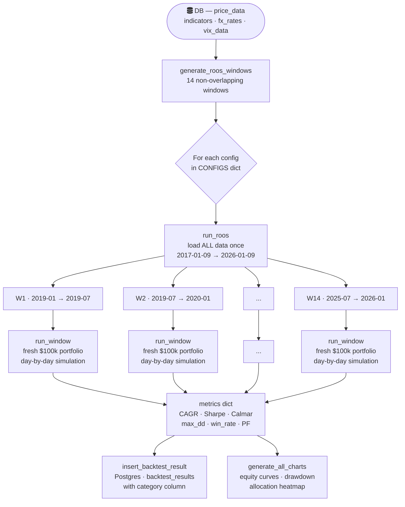
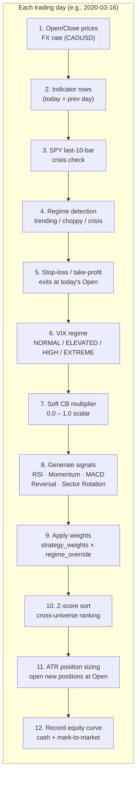
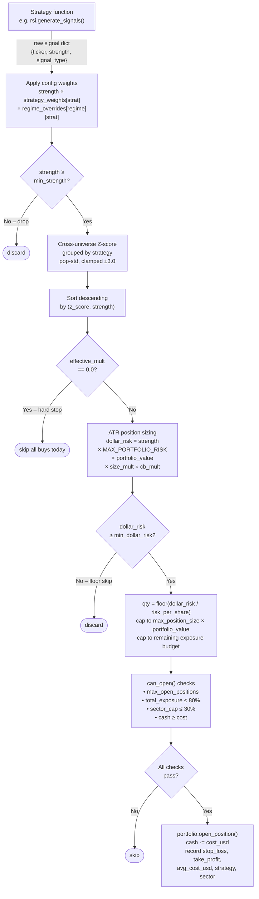

# Kairos Rolling Out-of-Sample (ROOS) — How It Actually Works

## What is ROOS?

Rolling Out-of-Sample (ROOS) is a way of backtesting that avoids curve-fitting a strategy on the same data you're evaluating it on. Instead of optimising on the full history and then declaring "it worked," ROOS slices time into a rolling sequence of **train → test** pairs. Every test window is **genuinely out-of-sample** — the strategy never saw that data during its setup.

In Kairos, the parameters being tested are the **allocation configs** in `config.py` (strategy weights, regime overrides, min-strength thresholds, vol-filter flags, etc.). The ROOS machinery runs each config through every test window and scores how it performed on data it had no access to.

---

## Window Layout

```
config.py constants
────────────────────
ROOS_DATA_START  = 2017-01-09   ← earliest row in DB with indicators
ROOS_TRAIN_YEARS = 2            ← how long each training period lasts
ROOS_TEST_MONTHS = 6            ← how long each test window lasts
INITIAL_CAPITAL = $100,000     ← fresh capital at the start of EVERY window
```

Each window is generated by `data_loader.generate_roos_windows()`:

```
test_start = DATA_START + 2 years = 2019-01-09
train for window N = [test_start_N - 2yr, test_start_N)
test for window N  = [test_start_N,        test_start_N + 6mo)
next window starts at the end of the previous test window  (no overlap)
```

The full sequence of windows currently looks like this:

| # | Train window | Test window |
|---|---|---|
| W1  | 2017-01-09 → 2019-01-09 | **2019-01-09 → 2019-07-09** |
| W2  | 2017-07-09 → 2019-07-09 | **2019-07-09 → 2020-01-09** |
| W3  | 2018-01-09 → 2020-01-09 | **2020-01-09 → 2020-07-09** ← COVID crash |
| W4  | 2018-07-09 → 2020-07-09 | **2020-07-09 → 2021-01-09** |
| W5  | 2019-01-09 → 2021-01-09 | **2021-01-09 → 2021-07-09** |
| W6  | 2019-07-09 → 2021-07-09 | **2021-07-09 → 2022-01-09** |
| W7  | 2020-01-09 → 2022-01-09 | **2022-01-09 → 2022-07-09** ← rate-hike bear |
| W8  | 2020-07-09 → 2022-07-09 | **2022-07-09 → 2023-01-09** |
| W9  | 2021-01-09 → 2023-01-09 | **2023-01-09 → 2023-07-09** |
| W10 | 2021-07-09 → 2023-07-09 | **2023-07-09 → 2024-01-09** |
| W11 | 2022-01-09 → 2024-01-09 | **2024-01-09 → 2024-07-09** |
| W12 | 2022-07-09 → 2024-07-09 | **2024-07-09 → 2025-01-09** |
| W13 | 2023-01-09 → 2025-01-09 | **2025-01-09 → 2025-07-09** |
| W14 | 2023-07-09 → 2025-07-09 | **2025-07-09 → 2026-01-09** |

> **Important:** The training period is *not* simulated — no trades are run inside it. It exists purely to make sure indicator history (ATR, MACD signal, RSI, MA-50/200…) is available from day 1 of the test window. The config parameters (weights, thresholds) are fixed by the human, not fitted to the training data.

---

## Top-level Architecture



---

## Inside a Single Test Window

`run_window()` iterates over every trading day in the test period. SPY's OHLCV is used as the market calendar — if SPY has a row for that date, it's a trading day.



At the **very end** of the window, any still-open positions are force-closed at the last day's Close price and tagged `exit_type = "end_of_window"`. These are excluded from win-rate / profit-factor stats (they would bias the sample since the strategy didn't decide to exit them — time ran out).

---

## Capital Handling Between Windows

Kairos supports two ROOS categories that control how capital flows between windows:

### `capital_refresh` (default)

**Each window starts with a completely fresh portfolio of `$100,000` USD.**

```
W1 test result  →  final_value = $107,430   ← discarded
W2 test result  →  fresh $100,000 again
W3 test result  →  fresh $100,000 again (even though W2 lost money)
...
```

This is the default mode. The purpose is to measure the *quality* of the strategy per unit of opportunity, not simulate a real account. If W3 ran on W2's ending balance, a bad W2 would handicap W3's results even if W3's signals were great — making cross-config comparison meaningless.

The per-window `final_value_usd` and `total_pnl_usd` metrics are reported individually. You can sum `total_pnl_usd` across all windows to get aggregate P&L (as the backtest summary printer does), but each window's risk ratios (Sharpe, Calmar) are computed independently on that window's clean $100k baseline.

### `capital_compounded`

**Capital carries forward from one window to the next.**

```
W1 test result  →  final_value = $107,430
W2 starts with  →  $107,430 (carried forward from W1)
W2 test result  →  final_value = $103,200
W3 starts with  →  $103,200 (carried forward from W2)
...
```

This mode simulates how a real account would compound (or draw down) over the full ROOS period. Each window's metrics (Sharpe, CAGR, max drawdown) are computed relative to that window's actual starting capital, so they still reflect local performance quality. However, absolute dollar P&L reflects the snowballing effect of prior wins/losses.

Use this mode to answer: "What would my account look like if I had been running this config since 2019?"

### Running capital modes

By default, `make backtest` runs **both** capital modes for every config. Use the `--capital-mode` flag to run only one:

```bash
make backtest                                                              # both modes
make backtest-config CONFIG=adaptive_shield_v1                             # both modes, one config
python -m backtesting.run_backtest --capital-mode capital_refresh           # refresh only
python -m backtesting.run_backtest --capital-mode capital_compounded        # compounded only
```

Each capital_mode × config combination gets its own `run_id` and is stored with `category` ('roos') and `capital_mode` columns in the `backtest_results` table. The dashboard displays the capital mode as a badge ("Refresh" / "Compounded") on the runs list and detail views.

---

## Sample Trade Walk-Through — W3 (COVID Crash, Jan–Jul 2020)

Window 3 is the most instructive because it contains the sharpest drawdown in the dataset. Here is a hypothetical trace through a few key days for config `vol_filtered_regime_adaptive`.

### Day 1 — 2020-01-09 (Thursday, market open)

Portfolio state at start: **cash = $100,000, positions = {}**

```
Indicators loaded for ~150 tickers
Regime:  SPY last-10-bar → TRENDING  (pre-crash, momentum still intact)
VIX:     ~13  →  NORMAL
CB mult: 1.0  (no drawdown yet)
```

Signals generated:

| Ticker | Strategy | Raw strength | weight×regime | Final strength | Z-score |
|--------|----------|-------------|---------------|----------------|---------|
| AAPL   | momentum | 0.72        | ×1.3          | 0.936          | +2.1    |
| MSFT   | momentum | 0.68        | ×1.3          | 0.884          | +1.8    |
| AMZN   | macd     | 0.60        | ×1.2          | 0.720          | +0.9    |
| JPM    | rsi      | 0.55        | ×0.3          | 0.165          | −0.8    |

**Sizing AAPL** (`fill_price = $75.08`, `ATR-14 = $1.42`):
```
stop_loss    = 75.08 - (2.0 × 1.42) = $72.24
take_profit  = 75.08 + (3.0 × 1.42) = $79.34
risk_per_shr = $2.84

dollar_risk  = strength × MAX_PORTFOLIO_RISK × portfolio_value × effective_mult
             = 0.936 × 0.02 × $100,000 × 1.0
             = $1,872

qty = floor($1,872 / $2.84) = floor(659.2) = 659 shares
cost = 659 × $75.08 = $49,478  ✓ (< 10% cap of $10,000? NO — capped)

max_by_size  = 0.10 × $100,000 = $10,000
qty_capped   = floor($10,000 / $75.08) = 133 shares
cost_capped  = 133 × $75.08 = $9,986
```

Cash after AAPL: `$100,000 - $9,986 = $90,014`

Similar logic fires for MSFT and AMZN. After all three positions:
- Cash ≈ $70,000
- 3 open positions, total exposure ≈ 30%

---

### Day 42 — 2020-02-24 (Monday — first big COVID drop, SPY -3.4%)

```
Regime:  CRISIS  (SPY 10-bar drawdown threshold crossed)
VIX:     36.0  →  HIGH
CB mult: 0.80  (soft CB: portfolio down ~5%, interpolated toward 0.25)
effective_mult = size_mult(vol) × cb_mult(soft_cb) = 0.6 × 0.80 = 0.48
```

**Exits at Open (stop-loss):**

MSFT opens at $162.90, below its stop at $171.30 → **stop_loss exit**.

```
qty = 61 shares  (cost_usd = $10,005  at entry)
exit_proceeds = 61 × $162.90 = $9,937
pnl_usd = $9,937 - $10,005 = -$68   (−0.7%)
```

**New BUYs suppressed in CRISIS regime** — momentum and MACD weights are crushed to `0.1`, most signals fall below `min_strength = 0.10`. Reversal gets `1.5×` weight but the market has only just started dropping so few reversal triggers exist yet.

With `effective_mult = 0.48`, any position that does get through is half-sized. The portfolio stops adding new risk.

---

### Day 61 — 2020-03-23 (Monday — COVID trough, SPY -34% from Feb peak)

```
Regime:  CRISIS
VIX:     82.7  →  EXTREME
CB mult: 0.0   (portfolio down >12% from its peak  → hard stop)
effective_mult = 1.0 × 0.0 = 0.0
```

All `buy_signals` survive the filter, Z-scores are computed… but `effective_mult == 0.0` so the loop immediately `continue`s on every signal. **Zero new positions are opened.** Capital is preserved in cash, waiting for the regime to normalise.

---

### Day 90 — 2020-04-29 (Wednesday — recovery phase)

```
Regime:  CHOPPY  (volatility high but SPY bouncing)
VIX:     33.2  →  HIGH  (still elevated but falling)
CB mult: 0.62  (portfolio recovering, soft CB linearly releasing)
effective_mult = 0.7 × 0.62 = 0.43
```

RSI signals dominant (choppy weight `1.3×`). Momentum suppressed (`0.2×`).

A reversal signal on BA fires at strength `0.58`. After weight: `0.58 × 0.6 × 1.5 = 0.52`.
Sizing multiplied by `0.43` → positions are less than half of normal size. Strategy is cautiously re-entering.

---

### Final day — 2020-07-09 (end of W3)

All remaining open positions are force-closed at today's Close.

```
Portfolio final value:  ~$96,200  (−3.8% over the window)
total_pnl_usd:         −$3,800
max_drawdown:          ~18%  (at the March trough)
win_rate:              54%   (stop-losses dominated in Feb–Mar)
Sharpe ratio:          −0.34
Calmar ratio:          −0.21
```

These metrics are stored in `backtest_results` for this window. In `capital_refresh` mode, W4 begins with a **clean $100,000** — the $96,200 ending balance is not carried forward. In `capital_compounded` mode, W4 would start with **$96,200**.

---

## Soft Circuit Breaker — Detailed Mechanics

One of the most important risk overlays is the **soft CB** (Phase 4.8), used by configs like `vol_adaptive_soft_cb`, `vol_adaptive_full_v2`, and `vol_adaptive_conservative_v2`.

```
cb_soft_start = 0.05   ← drawdown at which position sizing starts shrinking
cb_hard_stop  = 0.12   ← drawdown at which all new buys stop (effective_mult = 0)
cb_min_mult   = 0.25   ← minimum multiplier at cb_hard_stop

Linear interpolation in the band [5%, 12%]:
  cb_mult = 1.0 - ((1.0 - 0.25) × (dd - 0.05) / (0.12 - 0.05))
```

```
dd = 0%    → cb_mult = 1.00  (full size)
dd = 5%    → cb_mult = 1.00  (trigger not yet hit)
dd = 7%    → cb_mult = 0.786
dd = 9%    → cb_mult = 0.571
dd = 11%   → cb_mult = 0.357
dd = 12%   → cb_mult = 0.25  (minimum — still trading, just tiny)
dd > 12%   → cb_mult = 0.00  (hard stop — no new positions)
```

**VIX-linked recovery hold (Change 2):** After the CB was active, even if the drawdown recovers above `cb_soft_start`, the system holds at the last CB multiplier for a minimum number of days before releasing back to 1.0. This prevents "chatter" where one good day fully re-opens sizing, only for it to shut down again the next dip.

```
NORMAL regime   →  hold for 3 days after recovery
ELEVATED        →  hold for 5 days
HIGH            →  hold for 8 days
EXTREME         →  hold for 12 days
```

---

## How Metrics Roll Up

After all windows complete, `_print_summary()` aggregates across windows:

```
aggregate_pnl       = sum(window.total_pnl_usd)
avg_cagr            = mean(window.cagr)             ← equal-weighted per window
avg_sharpe          = mean(window.sharpe_ratio)
avg_max_drawdown    = mean(window.max_drawdown)
best_window         = argmax(window.total_pnl_usd)
worst_window        = argmin(window.total_pnl_usd)
pct_profitable_wins = count(window.total_pnl_usd > 0) / total_windows
```

The aggregate view lets you see whether a config *consistently* performs well across different regimes (bull, crash, recovery, choppy sideways) — not just on one lucky stretch of data.

---

## When to Use Each Category

### `capital_refresh`
Use for **config ranking and comparison**. Every window is a fair, equal-sized experiment. A config that performs well across 14 independent $100k tests is reliably good — not just lucky on one stretch.

### `capital_compounded`
Use for **realistic account simulation**. Shows the compounding effect of wins and the snowball of losses. The final value after all windows tells you what a real account would look like. Position sizes naturally grow or shrink with the account size.

---

## Signal → Trade Pipeline (One Position, Full Detail)



---

## Key Files Reference

| File | Role |
|------|------|
| [backend/backtesting/config.py](backend/backtesting/config.py) | ROOS constants + all allocation configs |
| [backend/backtesting/data_loader.py](backend/backtesting/data_loader.py) | `generate_roos_windows()`, OHLCV/indicator/FX/VIX loaders |
| [backend/backtesting/portfolio_runner.py](backend/backtesting/portfolio_runner.py) | `run_window()` day-loop, `run_roos()` orchestrator, metrics |
| [backend/backtesting/run_backtest.py](backend/backtesting/run_backtest.py) | CLI entry point, DB writes, summary printer |
| [backend/strategies/vol_regime.py](backend/strategies/vol_regime.py) | VIX regime classification + soft CB inputs |
| [backend/strategies/regime.py](backend/strategies/regime.py) | `detect_all()` — trending/choppy/crisis per ticker |

Run a single config with:
```bash
make backtest-config CONFIG=adaptive_shield_v1
```

Run all configs:
```bash
make backtest
```
